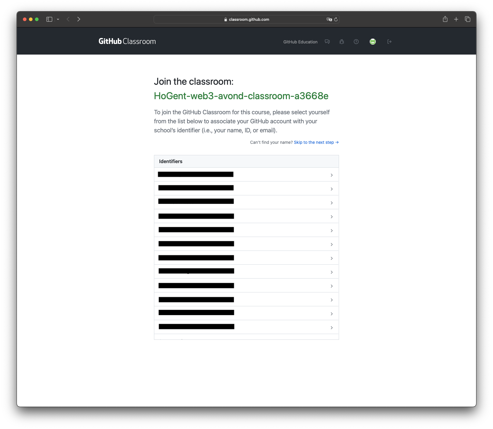
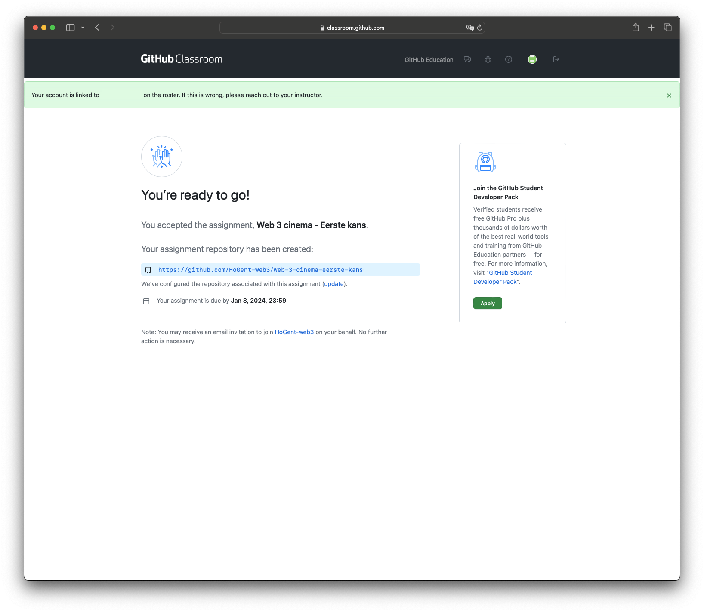
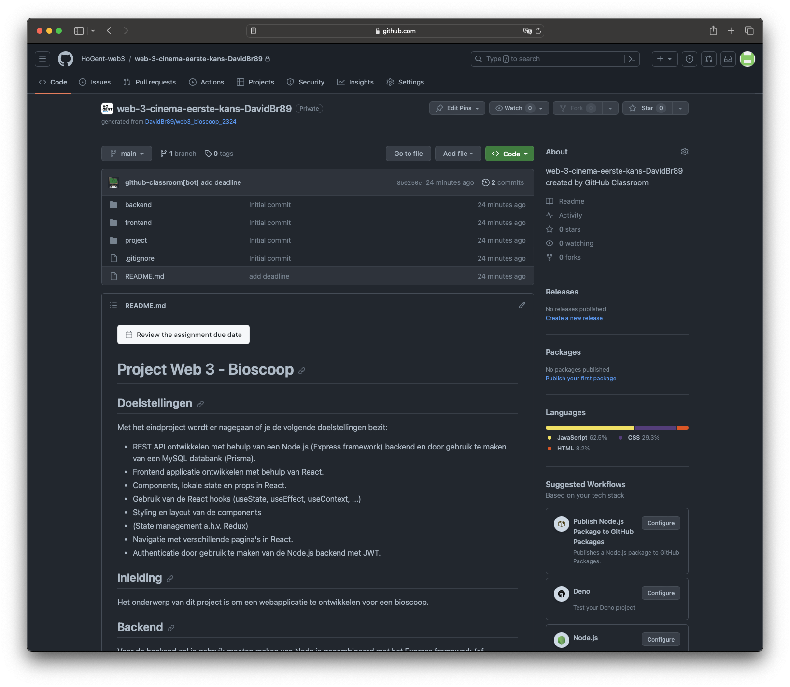
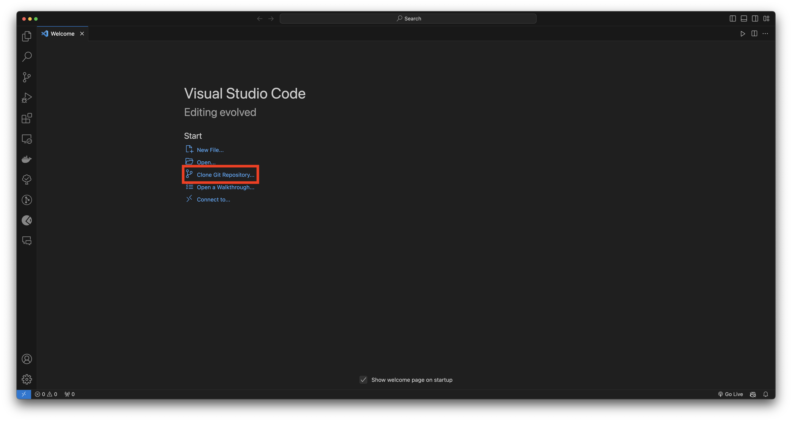

# Project Web 3 - Bioscoop

## Doelstellingen

Met het eindproject wordt er nagegaan of je de volgende doelstellingen bezit:

- REST API ontwikkelen met behulp van een Node.js (Express framework) backend en door gebruik te maken van een MySQL databank (Prisma).
- Frontend applicatie ontwikkelen met behulp van React.
- Components, lokale state en props in React.
- Gebruik van de React hooks (useState, useEffect, useContext, ...)
- Styling en layout van de components
- (State management a.h.v. Redux)
- Navigatie met verschillende pagina's in React.
- Authenticatie door gebruik te maken van de Node.js backend met JWT.

## Inleiding

Het onderwerp van dit project is om een webapplicatie te ontwikkelen voor een bioscoop.

## Backend

Voor de backend zal je gebruik moeten maken van Node.js gecombineerd met het Express framework (of gelijkaardig). De bedoeling is dat je een REST API server maakt, zodanig dat de frontend applicatie zijn data kan opvragen a.h.v. REST operaties.

Je zal ook een databank (MySQL, ProstgreSQL, MongoDB, ...) moeten aanmaken en deze koppelen aan uw Node.js backend. Je kan hiervoor gebruik maken van een ORM zoals Prisma (wat we in de lessen besproken hebben). Je krijgt hiervoor al reeds een relationeel gegevensmodel mee (terug te vinden in de project folder) maar je mag dit steeds uitbreiden met extra elementen.

[Relationeel gegevensmodel](./project/DB_schema.pdf)

### Structuur

Voor de structuur van uw backend is het aan te raden om gebruik te maken van de mappenstructuur die we tijdens de lessen gezien hebben, en die uiteindelijk in het startersproject gebruikt wordt.

[Backend](./backend/)

```
├── bin
│   ├── www
├── controllers
|   ├── index.js
├── middlewares
|   ├── index.js
├── routes
|   ├── index.js
├── prisma
|   ├── schema.prisma
├── .gitignore
├── app.js
├── package.json
```

> [!IMPORTANT]
> Let op de naamgeving van uw files in Node.js. Best practice maken we gebruik van snake_case voor onze files bvb. `users_routes.js` i.p.v. `usersRoutes.js`.

> [!IMPORTANT]
> Gebruik ook de nieuwere ES6 (of hoger) syntax en gebruik dus nergens het `var` keyword.

## Frontend

Voor de frontend zal je gebruik moeten maken van React. Je moet dus een frontend ontwikkelen die gebruikt zal worden door de klanten van onze bioscoop. De user interface is vrij te kiezen en heb je dus absolute vrijheid in (laat uw creativiteit maar los 😉). Uw applicatie moet wel effectief gestyled zijn, dus niet zomaar standaard zwart wit zonder enige vorm van styling.

De frontend applicatie zal dus gebruik moeten maken van de REST API die je geschreven hebt om data op te vragen/aan te maken, ...

### Structuur

Alsook voor de structuur van uw frontend is het aan te raden om gebruik te maken van de volgende mappenstructuur:

[Frontend](./frontend/)

```
├── public
│   ├── ...
├── src
|   ├── assets
|   ├── components
|   ├── contexts
|   ├── navigation
|   ├── pages
|   ├── store
|   ├── utils
|   ├── App.css
|   ├── App.jsx
|   ├── index.css
|   ├── main.jsx
|   ├── index.css
├── .eslintrc.cjs
├── .gitignore
├── package.json
├── README.md
├── vite.config.js
```

> [!IMPORTANT]
> Let op de naamgeving voor React components. Dit verloopt steeds via Pascal case bvb. `HomeComponent.jsx` i.p.v. `homeComponent.jsx`.

> [!IMPORTANT]
> We gebruiken functional components in React en dus nergens geen class components. Dit omdat we anders geen gebruik kunnen maken van de React hooks.

## Werking

> [!IMPORTANT]
> Lees dit aandachtig door want hier staan de vereisten voor uw web applicatie en de backend.

Je zal dus een web applicatie moeten maken voor een bioscoop. De gebruiker kan dus op onze pagina een voorstelling kiezen en hiervoor tickets kopen. Je kan inspiratie opdoen op verschillende websites van bioscopen (bvb. Kinepolis, UGC, ...)

In eerste instantie heb je een overzicht nodig van alle films die momenteel gespeeld worden in onze bioscoop. Hier is het de bedoeling dat je natuurlijk de titel van de film en de afbeeldingen toont van de filmposters eventueel extra informatie zoals het releasejaar, ...

Op een tweede pagina (na het klikken op een film) ga je naar een pagina waar meer info over de film getoond wordt. Het zou kunnen dat er meerdere voorstellingen van deze film zijn en deze moeten ook getoond worden op het scherm. De gebruiker kan dan op een voorstelling klikken om hiervoor een ticket te kopen.

Op een derde pagina kan de gebruiker zijn ticket kopen. OPGELET de gebruiker moet ingelogd zijn om een ticket te kunnen kopen voor de voorstelling. Dus je moet ook een login pagina en registreer pagina voorzien (Het herstellen van een wachtwoord is niet nodig, maar mag natuurlijk wel toegevoegd worden). De gebruiker kiest het aantal tickets en zijn plaats en kan virtueel betalen.

Op een vierde pagina heb je dan de bevestiging van de tickets die gekocht zijn geweest voor de voorstelling van de film, hier worden ook details getoond zoals welke zaal, de datum, de details van de film, ...

> [!IMPORTANT]
> Opgelet, deze data die getoond wordt bij de bevestiging moet vanuit de databank komen dus dit mag niet in de frontend doorgegeven worden.

Je zal ook nog een account pagina moeten aanmaken waarbij de ingelogde gebruiker al zijn tickets kan bekijken die hij gekocht heeft.

## GitHub Classroom

Om de voortgang van het project kunnen te volgen is het **verplicht** om gebruik te maken van GitHub. Om het overzichtelijk te houden voor mij maak ik gebruik van GitHub Classroom waarbij er automatisch op jouw account een private repository aangemaakt wordt bij het aanvaarden van de assignment.

Ik heb hier ook automatisch toegang toe. Ik kan deze repositories heel simpel opvolgen en als er bijvoorbeeld problemen zijn kan ik ook veel makkelijker mee kijken met de code die je al hebt.

### Stappenplan

1. Surf naar volgende link [GitHub opdracht link](https://classroom.github.com/a/gwF8wGO0) en koppel jouw GitHub account aan de classroom.
2. Je krijgt in principe zoals te zien is in de afbeelding een lijst met namen te zien, klik op jouw naam zodanig dat de koppeling gemaakt kan worden. (Vanaf dit moment wordt jouw repository voor jou klaar gemaakt in uw account).



3. Je krijgt normaal gezien nog eens een bevestigingsscherm met de gegevens over de aangemaakt repository. Als je hierop door klikt kan je naar uw repository gaan en deze repository dus clonen via VSCode of manueel via de commandline.



4. Eénmaal in jouw persoonlijke repository kan je dus vanaf nu werken met deze repository. De bedoeling is dus dat je enkel en alleen uw project hierin maakt en regelmatig een commit doet van uw werk, dat ik dit makkelijk kan opvolgen.



5. In VSCode kan je nu makkelijk jouw repository clonen en beginnen werken aan dit project.



> [!IMPORTANT]
> Er staat geen minimum op het aantal commits dat er nodig zijn. Maar om een zeker opvolging te hebben is het natuurlijk niet de bedoeling dat je maar 1 commit doet voor het volledige project. Je zal zoals bij elk project onder versiebeheer het beste genoeg commits doen.

## Deadline

### Eerste kans

De **deadline** voor de eerste kans ligt op **8 Januari 2024 - 23h59** om het project in te dienen. Je zal dit ook nog eens voor administratieve redenen als een zip moeten uploaden op Chamilo bij de opdracht die open staat. Let dus goed op de deadline.

De **verdediging** van de eerste kans gaat door op **9 Januari 2024 - op afspraak** via Teams. Er zal binnenkort een link gedeeld worden waarbij je een tijdsslot kan boeken om uw project te verdedigen en een demo te geven.

### Finale kans

De **deadline** voor de finale kans ligt op **22 Januari 2024 - 23h59** om het project in te dienen. Je zal dit ook nog eens voor administratieve redenen als een zip moeten uploaden op Chamilo bij de opdracht die open staat. Let dus goed op de deadline.

Voor de finale kans is het meestal zo dat je mag verder werken aan het project om de feedback die je gekregen hebt te verwerken.

De **verdediging** van de eerste kans gaat door op **23 Januari 2024 - op afspraak** via Teams. Er zal binnenkort een link gedeeld worden waarbij je een tijdsslot kan boeken om uw project te verdedigen en een demo te geven.

> [!IMPORTANT]
> De deadline is een definitieve deadline, je verliest de schrijfrechten automatisch op de deadline op de repository. Dus organiseer goed jouw werk.

## Vragen

Als er nog vragen zouden zijn kan je mij steeds contacteren op [david.breckx@hogent.be](mailto:david.breckx@hogent.be).

VEEL SUCCES!
